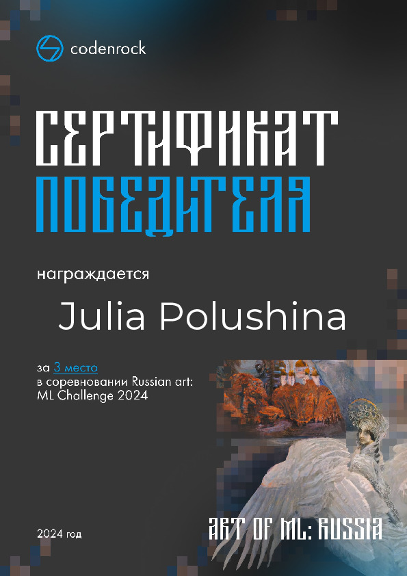

# Russian art: ML Challenge 2024


###  Описание соревнования
🚀 Увлекаешь машинным обучением? Тогда скорее попробуй свои силы в Russian art: ML Challenge 2024!

🖼 Задача Russian art: ML Challenge – научиться распознавать типы произведений народного искусства Российской Федерации по фотографии. От живописи и скульптуры до ремесленных изделий и архитектуры. Главная цель – точная настройка алгоритма распознавания с использованием метрики F1 macro.

##### Процесс сабмита решений

Описание процесса сабмита решений на проверку описано в [README_Competition.md](README_Competition.md)


## Победное решение (3-е место)



[Ссылка](https://codenrock.com/users/52205/certificates/193) на сертификат победителя


###  Описание финального решения

Наилучшего результата удалось получить с помощью расчета эмбедингов изображений произведений искусства с помощью предобученных весов модели DINOv2 от Facebook. 
При расчете эмбедингов были усреднены final hidden state по всей выходной последовательности (дало лучшие результаты, чем только CLS token). 
Финальная классификация рассчитанных эмбедингов изображений произведений искуства производится с помощью алгоритма Support Vector Classifier 

###  Запуск обучения


####  Подготовка рабочего окружения
```bash
make install_all
```

#### Обучение модели

```bash
make run_training
```

#### Расчет файла для сабмита

```bash
make make_submission
```
